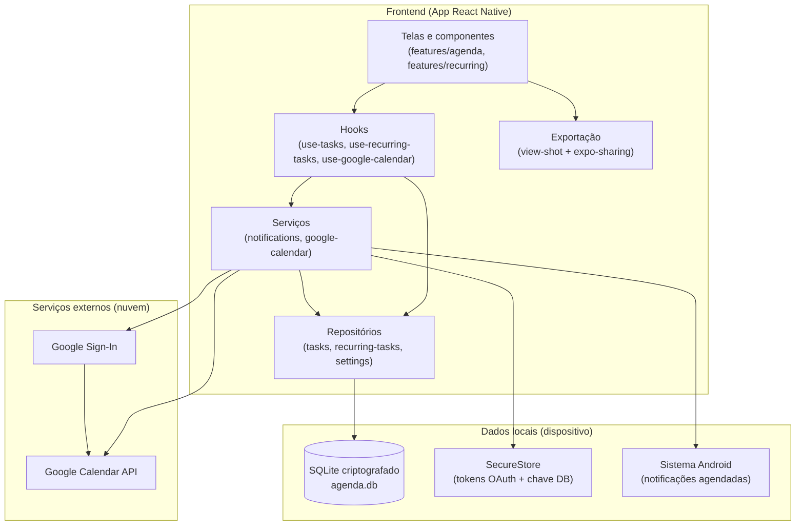
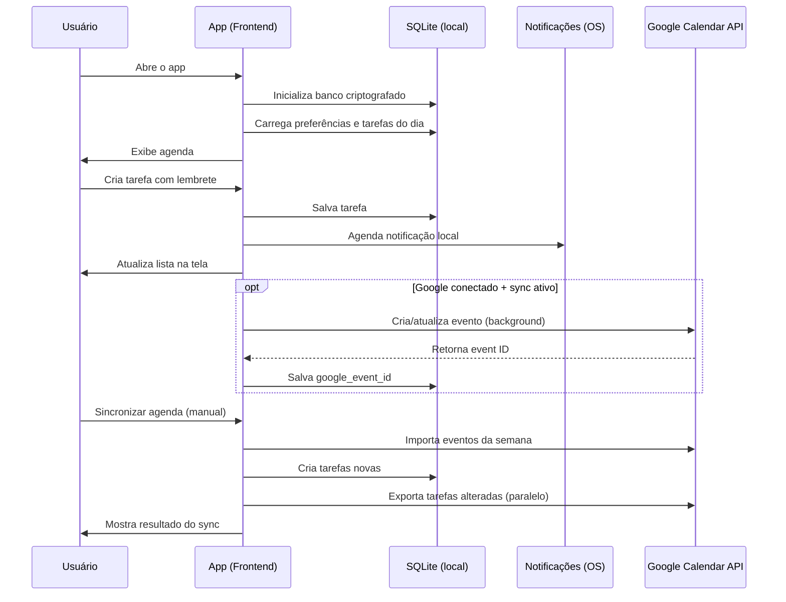
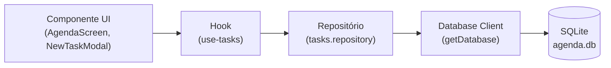
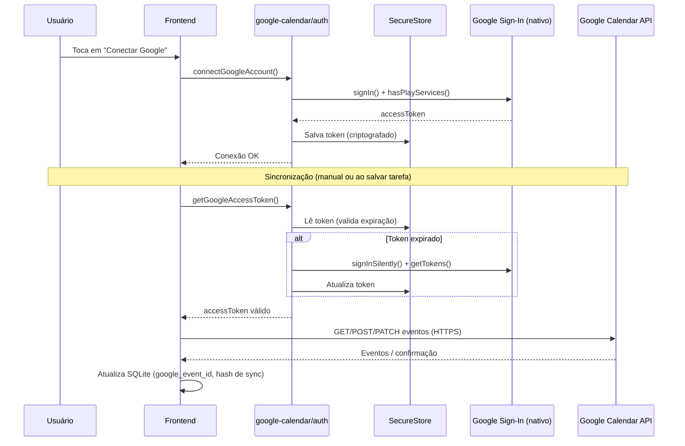
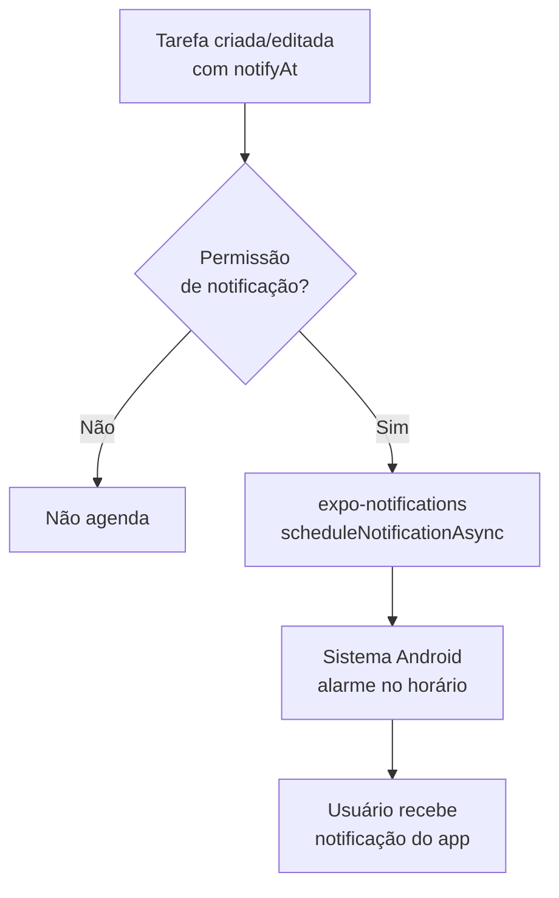
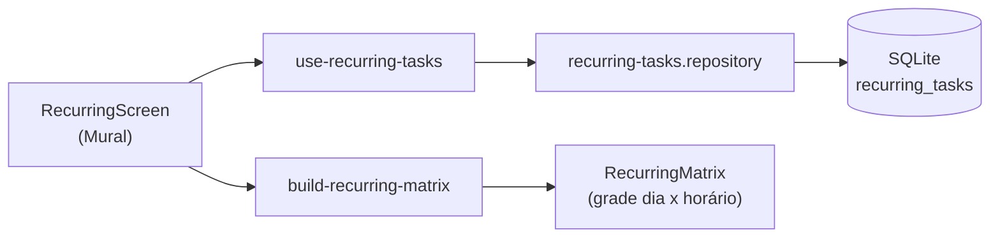
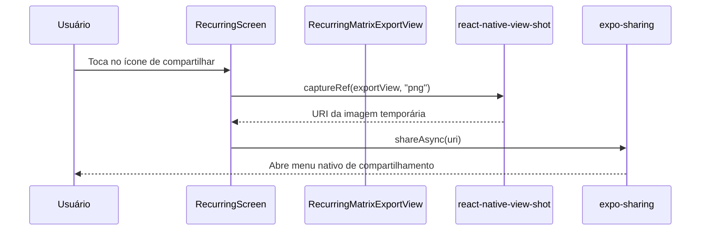
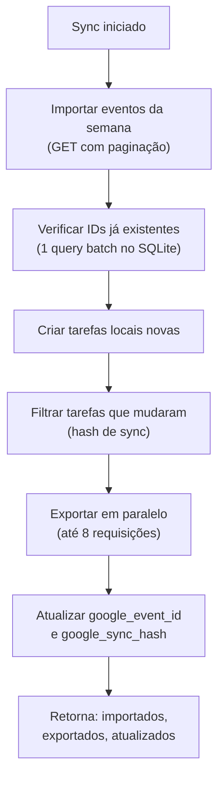

# Minha Agenda — Descrição do Projeto

## Visão geral

O **Minha Agenda** é um app **local-first**: os dados principais ficam no próprio celular. Não existe servidor/backend próprio (API REST, Node, Firebase etc.). O app funciona offline para criar, editar e concluir tarefas; a sincronização com o Google é opcional e feita diretamente do dispositivo para a API do Google.

| Camada | Tecnologia | Função |
|--------|------------|--------|
| **Frontend** | Expo SDK 54 + React Native + TypeScript | Interface, navegação e lógica de negócio |
| **Banco de dados** | SQLite (SQLCipher) no dispositivo | Persistência de tarefas e configurações |
| **Integração externa** | Google Calendar API + Google Sign-In | Sincronizar eventos com a conta Google |
| **Notificações** | expo-notifications (sistema Android) | Lembretes no horário da tarefa |
| **Exportação de imagem** | react-native-view-shot + expo-sharing | Gerar e compartilhar o mural da rotina semanal como PNG |

---

## Funcionalidades principais

- Calendário mensal com dias marcados que possuem tarefas
- Tarefas organizadas por período do dia (manhã, tarde, noite)
- Criação de tarefas com horário e lembrete local
- **Mural de rotina semanal**: cadastro de tarefas recorrentes (título, horário, dias da semana) exibidas em uma matriz dia × horário
- **Compartilhar mural**: exporta a matriz de rotina como imagem (PNG) e abre o menu de compartilhamento nativo do celular
- Tema claro/escuro, com sincronização da cor da barra de navegação do Android
- Navegação por abas (Agenda / Mural)
- Conexão com Google Agenda (OAuth)
- Sincronização manual ou automática ao salvar tarefa (quando notificação + Google estão ativos)
- Lembretes configuráveis no Google Calendar (ex.: 10 min antes)
- Banco local criptografado (SQLCipher) com chave no SecureStore

---

## Arquitetura



> **Nota:** não há backend intermediário. O app conversa diretamente com o banco local e, quando conectado, com a API pública do Google Calendar.

---

## Estrutura de pastas

```
src/
  app/
    (tabs)/                # Abas do app (Agenda, Mural) via Expo Router
  features/
    agenda/                # UI: calendário, tarefas, modais, painel Google
    recurring/             # UI: mural de rotina semanal
      components/          # Matriz de rotina, modal de criação/edição, view de exportação
      screens/              # RecurringScreen (mural)
      utils/                # build-recurring-matrix (monta a matriz dia x horário)
  hooks/                  # use-tasks, use-recurring-tasks, use-google-calendar, use-selected-date
  database/
    client.ts             # Abertura do SQLite + SQLCipher
    schema.ts             # Migrações e tabelas
    repositories/         # CRUD de tarefas, tarefas recorrentes e settings
  services/
    notifications/        # Agendamento de lembretes locais
    google-calendar/      # OAuth, sync, API do Calendar
  storage/                # Cache em memória das preferências
  context/                # Tema (claro/escuro) + cor da barra de navegação
  constants/              # Cores, validação, opções do Google
  types/                  # Tipos TypeScript (Task, RecurringTask, etc.)
  utils/                  # Datas, horários, concorrência
```

---

## Fluxo geral do aplicativo



---

## Fluxo: Frontend → Banco de dados

Toda operação de tarefa segue o mesmo padrão em camadas:



### Exemplo — criar tarefa

1. Usuário preenche o modal e confirma
2. `AgendaScreen` chama `addTask` do hook `use-tasks`
3. `createTask` no repositório faz `INSERT` parametrizado no SQLite
4. `scheduleTaskNotification` agenda lembrete no sistema operacional
5. `refresh` recarrega a lista do dia a partir do banco
6. Se Google estiver conectado, `syncTaskInBackground` envia o evento sem travar a UI


---

## Fluxo: Conexão com Google Agenda

Não há backend próprio para autenticação. O OAuth é feito **nativamente no celular** via `@react-native-google-signin/google-signin`.



### Escopo OAuth

- Permissão mínima: `https://www.googleapis.com/auth/calendar.events`
- Apenas leitura/escrita de eventos — sem acesso total à conta Google

---

## Fluxo: Notificações locais

Lembretes do app são **independentes** do Google Calendar.



- Canal Android: `task-reminders` (alta prioridade)
- ID da notificação salvo em `tasks.notification_id` para cancelar ao concluir/remover

---

## Fluxo: Mural de rotina semanal

Tarefas recorrentes ficam em uma tabela própria (`recurring_tasks`), separada das tarefas do dia. Cada rotina tem título, horário e uma lista de dias da semana em que se repete.



- `buildRecurringMatrix` agrupa as rotinas por horário único e por célula `dia-horário`, montando a grade exibida na tela
- Tocar em uma tarefa da matriz abre o modal de edição (`NewRecurringTaskModal`), que também permite excluir a rotina

### Compartilhar o mural como imagem



- `RecurringMatrixExportView` é uma versão da matriz renderizada fora da tela (invisível ao usuário) e usada só para gerar a imagem
- Não há upload para nenhum servidor: o compartilhamento usa o menu nativo do sistema (WhatsApp, e-mail, etc.)

---

## Fluxo: Sincronização Google Calendar



**Import:** Google → SQLite (eventos que ainda não existem localmente)  
**Export:** SQLite → Google (tarefas com notificação + sync Google ativo)  
**Otimização:** só reenvia ao Google se o conteúdo mudou (hash); export paralelo para semanas com muitas tarefas


